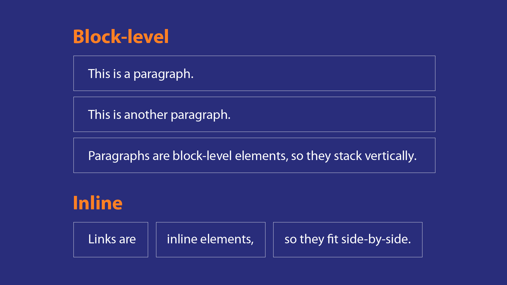
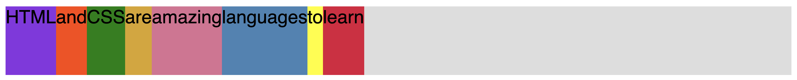
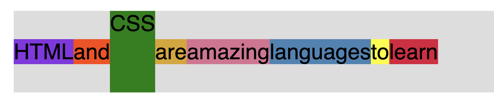
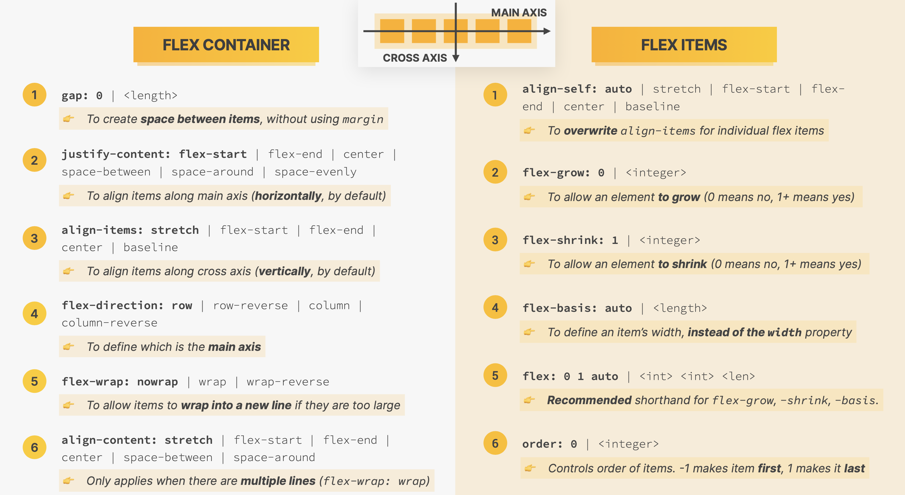

# What is CSS?

CSS describes the visual style and presentation of the content written in HTML. <br>

CSS takes on the format of a dictionary consisting on `property: value` pairs which make up a `declaration/style`.
Multiple `declarations/styles` are in the `declaration block` which in turn make up a `CSS rule`.

# Inline, Internal and External CSS

* Inline CSS <br>
  Writing the CSS inside the HTML element. Note that inline styling should never be used because it creates entanglement
  between HTML and CSS elements. Goes against "separation of concern" (SoC): a design principle separating a computer
  program into distinct sections.

````html
<h1 style="color:cornflowerblue;"> 📘 The Code Magazine</h1>
````

* Internal CSS <br>
  Declaring a `<style> </style>` element in the `<head> </head>` of our HTML doc. This is a good beginner option but
  presents issues since it can drastically increase the length of our HTML document.

```html

<head>
    <meta charset="UTF-8">
    <title>The Basic Language of the Web: HTML </title>
    <!-- <link href="main_style.css" rel="stylesheet"> -->
    <style>
        h1 {
            color: cornflowerblue;
        }
    </style>
</head>
```

* External CSS <br>
  Using a `style.css` sheet to hold the various CSS properties for our HTML elements. This is the best option since it
  properly separates out HTML code from our CSS rules. To implement:

First we declare the style sheet in our HTML doc:

```html

<head>
    <meta charset="UTF-8">
    <title>The Basic Language of the Web: HTML </title>
    <link href="main_style.css" rel="stylesheet">

</head>
```

Second, we define our CSS rules in `style.css`:

```css
h1 {
    color: firebrick;
}
```

# Styling Text

There are various text properties that can be applied to most HTML elements. Some of the most common ones are:

```css
h1 {
    color: firebrick;
    font-size: 26px;
    font-family: 'League Gothic', sans-serif;
    text-transform: uppercase;
    font-style: normal;
    text-align: center;
}
```

It is important to note that for `<ol>` or `<ul>` elements, only the `<li>` elements can be styled. So, we style the
list item not the actual list structure. We also see how inheritance works in CSS because all other elements inside
our `<p>` elements get styled based on the rules set for those p elements.

# Combining Selectors

Before combining selectors we have:

```css
h1 {
    color: firebrick;
    font-size: 26px;
    font-family: 'League Gothic', sans-serif;
    text-transform: uppercase;
    font-style: normal;
    text-align: center;
}

h2 {
    font-size: 40px;
    font-family: 'League Gothic', sans-serif;
    font-style: normal;
}

h3 {
    font-size: 30px;
    font-family: 'League Gothic', sans-serif;
}


h4 {
    font-size: 20px;
    font-family: 'League Gothic', sans-serif;
    text-transform: uppercase;
    text-align: center;
}

p {
    font-size: 22px;
    font-family: 'League Gothic', sans-serif;
    line-height: 1.5;
    color: dimgrey;
}

li {
    font-family: 'League Gothic', sans-serif;
    font-size: 20px;
}
```

Which shows how some properties are repeated. We can eliminate this redundancy and implement best practices by combining
selectors using `list selectors`:

```css
h1, h2, h3, h4, p, li {
    font-family: 'League Gothic', sans-serif;
}
```

Now, any change in the font-family will be implemented on all elements, and we won't have to change them one by one.

## Descendent Selector

To change the `<p>` text of the `<footer>` we use descendent selectors to specify we would like to change the p text of
the footer only.

```css
footer p {
    font-size: 12px;
}
```

Here we are saying "select the child p element of the footer element." It is important to note that descendent selectors
can present issues when the same parent-child relationships exists in our HTML doc.

```html

<div>
    <header>
        <p> What we want to style </p>
    </header>
</div>
<article>
    <header>
        <p> We do not want to style this </p>
    </header>
</article>
```

In this example, if we use descendent selector we would use `header p` but this would select both `p` tags in our doc.
To fix this, we use nested-descendent selectors:

```css
article header p {
    color: red;
}
```

# Class and ID Selectors

Class and ID selectors are a better option vs descendent selectors because it removes the HTML encoding in our css file.
In order to implement class and ID selectors we must first declare them in our HTML doc:

```html
<p id="author">
    Posted by <strong> Laura Jones</strong> on Monday. June 21st 2017
</p>
```

and then select them using the (hash) `#` in our css file:

```css
#author {
    color: red;
}
```

## ID vs Classes

The big difference between ID's and Classes is that we are not allowed to repeat ID names. We can have multiple HTML
elements with the same class, such as the "related post" author names (CSS convention is to use dashes -):

```html
<p class="author-name"> By Jonas Schmedtmann </p>
```

To style this, we use the class selector in css `.`:

```css
.author-name {
    color: saddlebrown;
}
```

It is noted that by default, we will stick mostly to using classes in order to prepare for future changes and limit
potential bugs.

# Working with Colors

Colors in CSS can be specified using two ways.

1. RGB Notation <br>
   Defined using the `rgb()`function. Can take a 4th value specifying the "alpha" (0.0 - 1.0).
2. Hexadecimal Notation <br>
   Written using `#00ffff`

## Shades of Grey

Grey colors are created when all three values in either RGB function or Hex pairs are the same. `rgb(183, 183, 183)`
and `#b7b7b7` are the same color.

# Pseudo-Classes

By definition, a pseudo-class is used to define a special state of an element. They are implemented using a colon
`:`. One way we can bold the first element on a list is:

```css
.first-li {
    font-weight: bold;
}
```

But we can use pseudo-classes to select the first child element as shown:

```css
li:first-child {
    font-weight: bold;
}
```

This wil select ALL list elements that are the first child of their parent element which can be either `ol` or `ul`. A
powerful function to use is `li:nth-child(x)`. Here we can specify integer location or keywords such as `odd` or
`even`. One thing to remember is that pseudo classes, when specified, select the first child of the parent element, so
it must be a direct child-parent relationship AND must be first or last. We cannot style the first `p` inside of
`article` because the `p` is not a direct child of `article`, it is a child of the `header`.

First we make sure the last-child of the `article` element is a `p` element.

```html
<p> Hopefully you learned something new here. See you next time! </p>
<!--  <button> Email Me</button> -->
</article>
```

Now we can use the pseduo-class `article p:last-child` to style that last child `p` element.

```css
article p:last-child {
    color: red;
}
```

# Styling Hyperlinks (LVHA)

Styling hyperlinks best practice is to style a pseudo class in order to style different states of the link.

1. Styling links requires us to find `a` tags that contain `href`.

```css
a:link {
    color: red;
    text-decoration: none;
}
```

There are other pseudo classes for links such as:

- `a:vistied`
- `a:hover`
- `a:active`

The order of these link pseudo classes matter and must always follow:

1. Link
2. Visited
3. Hover
4. Active

# CSS Theory #1: Conflicts Between Selectors

What happens when we have multiple selectors selecting the same element? Which CSS rule gets applied? <br>

<strong>All rules apply </strong> <br>

However, in the presence of conflicting declarations, there is a level of priority.

From highest to lowest priority we have:

1. Declarations marked `! important`
2. Inline style (style attribute in HTML)
3. ID (#) selector
4. Class (.) or pseudo class (:) selector
5. Element selector
6. Universal selector (*)

As an example, we added the following classes to the `p` tag of our `footer`. So now this element has both the class
`copyright` and `text`.

```html
<p id="copyright" class="copyright text">
    Copyright &copy; 2022 by Servin
</p>
```

We introduce conflicts in our selectors by declaring the following rules:

```css
/*  This selects the ID */
#copyright {
    font-size: 14px;
    color: red;

}

/*  This selects the class "copyright" */
.copyright {
    color: orange;
}

/*  This selects the class "text" */
.text {
    color: brown;
}

/*  This selects the p element that is inside the footer tag*/
footer p {
    color: blue;
}
```

The `p` element will start as red. But if we remove the `#copyright` styling, the element will turn yellow because next
in the priority is classes `copyright` and `text`. `text` gets applied since it comes last.

```css
.copyright {
    color: orange;
}

.text {
    color: brown;
}
```

We can hack this by using the `!important` keyword in our CSS declaration. We use it on this element selector since it
has the lowest priortiy in our example but by placing the `!important` keyword it is now being applied.

```css
footer p {
    color: blue !important;
}
```

To summarize,

```css
/*  Priority 1 */
#copyright {
    font-size: 14px;
    color: red;

}

/*  Priority 3 */
.copyright {
    color: orange;
}

/*  Priority 2 */
.text {
    color: brown;
}

/*  Priority 4 */
footer p {
    color: blue;
}
```

# CSS Theory #2: Inheritance and The Universal Selector

In CSS inheritance is a mechanism by which some css rules get their values inherited from parent elements. A basic
example would be to set styles to the `body` element which by definition, all other elements inside the body would
inherit those same styles. Note that not all properties get inherited, <strong> mostly it is text properties.
</strong> We must also remember the priority rules so any `body` property can easily be overwritten by any other type of
rule declaration.

```css
/*  All elements in the body will inherit this font family property */
body {
    font-family: 'League Gothic', sans-serif;
}

/*  This rule is no longer needed */

h1, h2, h3, h4, p, li {
    font-family: 'League Gothic', sans-serif;
}
```

Another example, you want to make the links inside the `nav` bar 18px.

```html
<!--Grouping links together inside a nav element -->
<nav class="navigation-links">
    <a href='other_page.html'> Other Page </a>
    <a href='#'> Challenges </a>
    <a href='#'> Flexbox</a>
    <a href='#'> Grid</a>
</nav>
```

If this is our `nav` element, we would use this simple css rule that by inheritance would make the links inside the nav
18px <strong>UNLESS</strong> otherwise stated.

```css
nav {
    font-size: 18px;
}
```

## The Universal Selector

The universal selector is used when we want certain properties to be applied to <strong> all </strong> elements. This is
NOT inheritance. This is applying a certain property to all elements. For this to be inheritance, the universal selector
had to be an HTML element, and it's not.

# CSS Theory #3: The CSS Box Model

As a basic definition, the CSS box model defines how elements are displayed on a webpage and how they are sized. <br>

Elements in the CSS Box Model are:

* Content: Text, image, etc.
* Border:  A line around the element, still inside the element.
* Padding: Invisible space around the content, inside the element.
* Margin: Space outside the element, between elements.
* Fill Area: area that gets filled with background color or background image.


## Element height and width calculations

* Final Element Width = left border + left padding + width + right padding + right border
* Final Element Height = top border + top padding + height + bottom padding + bottom border

Note that margin is not a part of the final width and height calculations because this is the space between elements.

# Using Margins and Paddings

An element that has background color is a good candidate to introduce some padding to create space between the content
and background. <br>

The `padding` property has shorthand notation which follows `padding: top/bottom left,right`. <br>

Margins can be introduced to list elements `li` to create space between them.

```css
li {
    font-size: 18px;
    /*line-height: 1.5; */
    margin-bottom: 10px;
}
```

However, this CSS rule will add margin to the last list item which is something we typically don't want. To work around
this we use a pseudo-class:

```css
li:last-child {
    margin-bottom: 0;
}
```

## Global Reset

In order to work with a clean slate and not have the default margin and paddings. We will do a "Global Reset" of both
margins and paddings to ALL elements by using the universal selector.

```css
* {
    margin: 0;
    padding: 0;
}
```

It is common to create vertical space using either `margin-top` or `margin-bottom`.

## Collapsing Margins

This occurs when we have two margins that occupy the same space, only one of them become visible on the page. The
outcome is a single margin whose size is the largest of the individual margins.


# Adding Dimensions (Height and Width)

We can add height and width to elements using `height` and `width` styling rules in CSS. For images, it is important to
note that we can also use `%` which will relate to the percentage of the parent element. For example, the code image we
have has a parent element of `header` which is the full width of the page.

```html

<header class="post-header">
    <h2> The Basic Language of the Web: HTML </h2>
    
    <p id="author">
        Posted by <strong> Laura Jones</strong> on Monday. June 21st 2017
    </p>
    
    <br>
    <button type="button" id="like-button"> ❤️ Like</button>

</header>
```

So, if we specify a CSS rule for `.code-image` using `100%` width, the image will take up the full width of the webpage.
This means, as we re-size the window the image will always be 100% of the parent element.

```css
.code-image {
    height: auto;
    width: 90%;
}
```

# Centering our Page

A neat trick to use when centering your page is to implement a `div` element as the parent of all other elements that
exists on your page. So, we introduce `<div class='container'> </div>'` and set its width to   `1000px`. Now, all of its
child element cannot have a width larger than the defined `1000px`. The logic here is "the child element can never be
wider than the parent element."

```css
.container {
    width: 1000px
}
```

The next step is to add margins to both the left and right and setting them to `auto`. This ensures the left and right
margins are always the same. Therefore, we get a nicely centered page.

```css
.container {
    width: 1200px;
    margin: 0 auto;
}
```

# CSS Theory #4: Types of Boxes

* Inline Boxes: Boxes that occupy only the space that they need. Only occupy the space of the element.
    * cause no line-breaks after or before the element.
    * custom box model application; height and width do not apply.
    * padding and margins are only applied left and right. (horizontally)
* Block Level Boxes / Block Level Elements: boxes that occupy all the space that they can and create line breaks. In
  other words, they cannot be side by side.
    * occupy 100% of parent's element width.
    * stacked vertically by default.
    * box model applies



Most of the elements that we will use are going to be block-level elements. We can turn elements into block using CSS
rule `display; block`. Similarly, we can turn elements into inline elements using `display: inline`.

## Inline-Block elements

Inline-block elements look like inline elements from the outside but behave like block-level elements on the inside.
Therefore, they only ocupy the content space and create no line breaks. Also, these elements are able to apply the
standard box model properties. It is common to create inline-block elements using `display: inline-block;`. It is
important to note that by default images have inline-block properties.

# CSS Theory #5: Absolute Positioning

Here we introduce two new concepts; Normal flow and Absolute Positioning.

* Normal Flow
    * represents the default positioning
    * it is said the element is "in flow".
    * Elements are simply laid out according to their order in the HTML code.
    * CSS property = `position: relative`
* Absolute Positioning
    * is it said the element was removed from the normal flow; "out of flow".
    * Has no impact on surrounding elements therefore might overlap them.
    * We use `top`, `bottom`, `left` or `right` to offset the element from its relatively positioned container.
    * CSS property = `position: absolute`

For example, we added a Like Button to our HTML using `<button type="button" id="like-button"> ❤️ Like</button>`, with
no regard to where it is placed since it will be positioned absolutely. Next, we define our CSS properties:

```css
#like-button {
    font-size: 22px;
    cursor: pointer;
    position: absolute;
    top: 0;
    left: 0;
}
```

This has caused our Like Button to appear at the very top left corner of our viewport. In order to have this element in
absolute positioning BUT NOT relative to the viewport we have to specifically set the position of the relative parent
element to relative. <br>

For this example, the parent element of this Like button is the `body` so we set the body to relative position.

```css
body {
    font-family: 'League Gothic', sans-serif;
    position: relative;
}
```

# Pseudo-Elements

Pseudo-elements are elements that don't exist in the HTML, but we can still select and style them. For example "the
first letter" or "first line" of a paragraph. In our page, if we want to make the book emoji not appear italic we will
use the following rule. Note that pseudo-elements are selected using two colons `::`.

```css
h1::first-letter {
    font-style: normal;
}
```

The "adjacent sibling" is the element that comes right after the elements in question. For example, if we want to style
the `p` elements that come after the `h3` elements we can use this "adjacent sibling" property.

```css
/* Adjacent sibling selector */
h3 + p::first-letter {
    color: orange;
}
```

## After and Before Pseudo-Elements

The "after" pseudo-element creates a pseudo-element that will automatically be the first child of the selected element.
This element is NOT in our HTML doc but rather created by this CSS property:

```css
h2::after {
    content: "TEST";
    background-color: #606060;
    color: whitesmoke;
    padding: 5px 15px;
    display: inline-block;
    position: absolute;
    top: -10px;
    right: -25px;
    font-size: 14px;

}
```

We must remember to make the parent element of this pseudo-element `position:relative` because we are using absolute
positioning.

# What are Layouts?

<dl>
    <dt> Layout</dt>
<dd> The way text, images and other content is placed and arranged on a webpage. </dd>
<dd> A way of introducing structure to our page into which we place our content.  </dd>

<dt> Building a Layout </dt>
<dd> Arranging page elements into a visual structure, instead of simply having them placed 
one after the other. (normal flow) </dd>

</dl>

# Page Layout vs Component Layout

<dl>
    <dt> Page Layout </dt>
<dd> Refers to the overall organization of a webpage consisting of various components. </dd>
  <dt> Component Layout </dt>
<dd> The organization of individual page components. </dd>

</dl>

# The 3 ways of building CSS layouts

1. Floats

The old way of building layouts of all sizes, using the css property `float`. Still used but getting outdated fast.

2. Flexbox

Modern way of laying out elements in a 1-dimensional row using floats. Perfect for component layouts.

3. CSS Grid

For laying out elements in a fully-fledged 2-dimensional grid. Perfect for page layouts and complex components.

# Using Floats

With this CSS property, the element being styled becomes sort of absolute positioned, causing other elements near it to
float around it:

```css
.author-image {
    float: left;
}
```

To make the other elements start AFTER the float element we can also give them the float property. This will cause them
to start after the floating elements.

```css
.main-author {
    margin-left: 90px;
    margin-top: 10px;
    float: left;
}
```

The `left` and `right` properties dictate what side of the container the element will start at. Also, a floated element
can still take `margin` properties which will follow conventional rules. <br>

When we float all the child elements of a parent element for example our `header`, we loose some padding and structure
of the page since technically, these elements are now floating. The height of the parent element now goes to `0`
since it now contains 0 elements. This is referred to as `the collapsing element`.

# Clearing Floats

Again, a parent element will collapse when all of its child elements are floated. To fix this, we insert a `div`
element with the class `clear` inside the parent element that collapsed and set its properties to:

```html

<header class="main-header">
    <h1> 📘 The Code Magazine</h1>
    
    
    <!--Grouping links together inside a nav element -->
    <nav class="navigation-links">
        <a href='other_page.html'> Other Page </a>
        <a href='#'> Challenges </a>
        <a href='#'> Flexbox</a>
        <a href='#'> Grid</a>
    </nav>
    
    <div class="clear"></div>
</header>
```

```css
.clear {
    clear: both;
}
```

However, we must note that this way of clearing floats is not practical because we introduce HTML code that holds no
value. We can instead use `the clear fix` hack. <br>

First we add the class `clearfix` to the parent element that is collapsing. In our example this is the `header`
element. Next we use the pseudo-element `after` in our CSS property declaration. This creates a "last child element"
for this parent element that is collapsing which is the same as adding an empty `div` manually. We then add the
following CSS properties to our pseudo-element:

```css
.clearfix::after {
    clear: both;
    display: block;
    content: '';
}
```

## Floats vs Absolute Position Elements

* With floated elements, text and inline elements will wrap around the floated element.
* The parent container elements of floated elements will not adjust its height.
* With absolute positioned elements, there is no impact on surrounding elements meaning there can be overlap.

# Box-Sizing: Border Box

We run into an issue when we add padding to the `aside` element because this extra padding causes the element to run out
of width space. Therefore, it moves to the bottom of the page. The total width of this aside element is now 380 and
since our total width cannot pass 1200, we get this issue. <br>

How to fix this issue? leave behind the default behavior of the box model. In terms of adding up total width and total
height. We apply this fix using the `box-sizing: border-box` CSS property. By convention, all web developers will add
this property to all elements in order to bypass the default behavior of the box model. <br>

Now, the final width and final height will simply be the values defined in the CSS property. Any padding added will
simply subtract from the content area.

```css
aside {
    width: 300px;
    float: right;
}

aside {
    border-top: 5px #003C71 solid;
    border-bottom: 5px #003C71 solid;
    background-color: #f7f7f7;
    padding: 35px 40px;
    box-sizing: border-box;

}
```

# Introduction to Flexbox

To get started using Flexbox, all we have to do is place the `display:flex` property on a container element. As a
reminder, a container element is an element that has child elements, ex `div`. <br>

The children elements of this parent container (flex container) are referred to as the flex items. By default, the flex
items only take us the space needed for its text content. Space not taken up can be seen by placing a colored background
to the parent container to visualize how much space is left. So, to summarize, horizontally the child elements only take
up the space needed, but vertically they take up the full height of the parent element or any max child height defined.



# Flexbox Common Usage

## Vertical Centering

A common usage for flex box is its ability to easily vertical center items. For this we use the `align-items:
center` property.




Now, these items are vertically aligned except for the `CSS` block since we have a defined height. We can also use
`flex-start` and `flex-end` properties to place the items on the top and bottom respectively. The default behavior
of `align-items` is `stretch` which means "take up the full height of the parent container/ tallest element." <br>

To summarize:

* `align-items:stretch` is the default behavior.
* `align-items:start` places the items at the top of the parent container.
* `align-items:center` places the items at the vertical center of the parent container.
* `align-items:bottom` places the items at the bottom of the parent container.

## Horizontal Centering

We can also horizontally center/move the items around the parent container using the `justify-content:` property. A neat
property is `justify-content: space-between` , which will take the elements and evenly space them out horizontally;
breaking up and extra space and creating margin.


# Flexbox Overview

<dl>
    <dt> Flexbox </dt>
<dd> A set of related CSS properties for building 1-dimensional layouts. </dd>
</dl>


The main idea for the creation of flexbox was the easy implementation of automatically dividing up the empty space in a
parent container among its child elements. Flexbox also makes it easy to align items to one another, that is child vs
child alignment inside a parent container. (Horizontal and Vertical Centering)

# Flexbox Terminology

<dl>
    <dt> Flex Container </dt>
<dd> The element on which we use flexbox. </dd>
<dd> Created by defining the display: flex; property. </dd>


<dt> Flex Items </dt>
<dd> The direct children of the Flex Container element. </dd>

<dt> Main Axis </dt>
<dd> Represents the horizontal axis. </dd>


<dt> Cross Axis </dt>
<dd> Represents the vertical axis. </dd>


</dl>

# Common Flex Container and Flex Items Properties



# Spacing and Aligning Flex Items

By definition, `align-items:stretch` will vertically align our child elements inside the parent element. However, we
might want to override this behavior and can do so using the `align-self` property.

## Ordering Items

Items by default have the property `order:0` which means they all share the same order. This does not match the physical
location of the item but rather the "logical order." So, we can arrange our items by defining an order less than 0 which
will in turn define order of location. The following property will place the "learn" text first.

```css
.el--8 {
    order: -1
}
```

The same logic applies for items given an `order` greater than 0. So if we want to move the text "CSS" to the right most
position, we give it an `order:1;` property. <br>

## Adding space between items

We can still add margin like normal however, the items might overflow the parent element. This is why, this route is not
recommended but rather we should focus on keeping all spacing and alignment properties in the flex box container. <br>

`gap` is the property we should use when adding spacing between items.

```css
/* NOT RECOMMENDED */
.el {
    margin-right: 10px;
}
```

Here we define the gap property inside the flex container and see that there is no margin being applied to the items so
this also eliminated the need to reset the `margin-right:0;` for the last item. To summarize, this does not add margin
but rather is a flex container property used to add spacing between items.

```css
.container {
    /* STARTER */
    font-family: sans-serif;
    background-color: #ddd;
    font-size: 40px;
    margin: 40px;

    /* FLEXBOX */
    display: flex;
    align-items: center;
    justify-content: flex-start;
    gap: 40px;
}
```

# The Flex Property

The `flex` property is what we use to size items. If we want our items to have a certain width, we use the
`flex-basis:` property.

```css
.el {
    flex-basis: 100px;
}
```

## Flex-basis and Flex-Shrink

Here we are stating the width of items. For items that are larger than this width, no change will occur. For items that
are not as wide, the element will expand to the defined width. In other words, this is treated mostly as a
"suggested width" for the flex items. The browser in the end will implement on optimal width to the elements. <br>

We can define a `flex-basis: 200px` but end up with elements having `width: 118px` because this is optimal for the
browser. Flexbox does this because by default the `flex-shrink` property is set to `1`. We can change this and force the
elements to be the desired width by defining `flex-shrink:0` property. We must be cautious of this because sometimes the
flex items can overflow the flex container.

## Flex-grow

The `flex-grow` property determines if elements can grow as large as they can or not.

```css
.el {
    flex-shrink: 0;
    flex-grow: 1;
}
```

Here we have:

* `flex-shrink:0` which means elements take up the width.
* `flex-grow:1` means elements grow as large as the parent container.

We can also increase the `flex` property values which will determine which element takes up most of the available space.
For example, is we make `html` have `flex-grow:2`: it will take up more space than the other elements. "More space"
for this example means double because 2 is double 1. <br>

As a best practice we should always define `flex: 1` and not use the individual `flex` properties in stand-alone
definitions. The order of properties defined is:

1. Flex-grow
2. Flex-shrink
3. Flex-auto