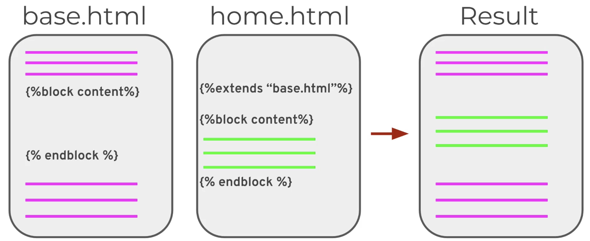

<h1 align="center"> How to build a Flask Application </h1>

## The Flask "Hello World" site

A basic Flask app "Hello World" page can be built using the following code:

```python
from flask import Flask

app = Flask(__name__)


@app.route('/')
def index():
    return '<h1> Hello World </h1> '


if __name__ == "__main__":
    app.run()
```

## Now, let's examine this code line by line.

1. First we import the Flask class from the flask package. <br>

```python
from flask import Flask
```

2. We create an application object as an instance of the Flask class. The `__name__` is a predefined name variable in
   Python. Which is set to the name of the module being used. This answers "are we running the script directly?"

```python
app = Flask(__name__)
```

3. Now we add pages to the application object we created from the Flask class. We do this by defining functions that
   return html.

```python
def index():
    return '<h1> Hello World </h1'
```

4. The function decorator directly links page to whatever route on your web application it should be at. For now, we
   route it to our home page/domain.

```python
@app.route('/')
```

5. At the button of the script we add `if __name__ == "__main__":`, which translates to "if you are running this script,
   run the application we created. "

```python
if __name__ == "__main":
    app.run()
```

## Basic Routes

How can we add multiple routes to our application (multiple pages)? The answer is in the `app.route()` function
decorator. The string parameter passed into the decorator determines the URL extension that will link to the function.
What this means is, this decorator parameter determines what "view"/"page" the user sees. <br>

Currently, our homepage/domain is locally represented at 'http://127.0.0.1:5000/'. The `/` represents our home page the
same way `/` represents our root directory.  <br>

Now, let's create another view called `page_two` which will be another html script that shows a simple html message.

1. We begin by decorating a view function with `app.route('/page_two')`.
2. We define the view function; the function decorated by the `app.route('page_two') and define the return value. What
   do you want the user to see when they visit this route/extension?
3. We run and test route by visiting 'http://127.0.0.1:5000/page_two' since that is the new route created.

### Creating a page_two route:

```python
from flask import Flask

app = Flask(__name__)


@app.route('/')  # this renders at http://127.0.0.1:5000/
def index():
    return '<h1> Hello World </h1> '


@app.route('/page_two')  # this will now render at 127.0.0.1:5000/page_two
def info():
    return "<h1> This is page two. </h1>"


if __name__ == "__main__":
    app.run()

```

## Flask Dynamic Routing

Dynamic Routing is when the URL route extension changes based on the situation. For example, we want the URL for user
Servin to be 'http://127.0.0.1:5000/Servin' and the URL for Baker to be 'http://127.0.0.1:5000/Baker'. That is, the URL
will change and update with the username of the person viewing the page. The standard URL for this
is 'www.site.com/user/unique_user_name'. <br>

Simple Dynamic Routing Example:

```python
@app.route('/monitor/<name>')  # the name in the route is passed to the view function as a parameter
def monitor(name):
    return f"<h1> This is a page for {name.upper()} </h1> "
```

## Flask Debug Mode

Debug mode allows you to see what type of error the Server and or application is encountering. This should be set to
False when application is ready for production. Let's create a route that returns back the 100th letter of the route
name.

1. Create route that returns 100th letter.

```python
@app.route('/debug/<name>')
def debug(name):
    return f"The 100th character of this name is {name[100]}."
```

Since there will be names with no 100th character this will return an error. But the error message will not be helpful.

```
Not Found
The requested URL was not found on the server. If you entered the URL manually please check your spelling and try again.
```

2. To be more helpful we set `app.run(debug=True)`. Now we get a more helpful error message.

```
IndexError
IndexError: string index out of range
```

The debug pin can be used to generate a console in the web application hosting to debug live. The pin is generated in
the terminal when the application runs and is needed to use the interactive/live debug functions.

## Template Basics

Realistically, we want to connect a view function to render HTML templates. Flask will automatically look for HTML
Templates in the <strong>templates</strong> directory.

1. We first create a templates' folder in the same directory level as our .py flask application.

```
/application.py
/templates
    /hello.html
```

2. We create the HTML page.
3. Using `from flask import render_templates` we define our view function and return the html template.

```python
@app.route('/')  # this renders at http://127.0.0.1:5000/
def index():
    return render_template('index.html')
```

## Updated Project Setup

To better organize our code, we will use the following directory setup.

* static folder for images
* templates for html pages
* application.py file for flask application.

```
/application.py
/templates
    /hello.html
/static
    /code_image.jpg
```

To reference the content inside the static folder we use `../static/file_name.jpg` which can read as "going back one
directory level, go into the static directory and use the file_name file."

## Template Variables

We want to be able to use Python code in our app, changing and updating variables and logic, and then send that
information to the template. To do this, we use the Jinja template engine. <br>

Jinja templating will let us directly insert variables from our Python code to the HTML file.

* Syntax: `{{some_variable}}`

1. We define a variable in our view function that we want to display in the HTML template.

```python
@app.route('/')  # this renders at http://127.0.0.1:5000/
def index():
    user_name = 'Servin'  # variable defined
    return render_template('index.html', user_name=user_name)
```

2. To insert this `user_name` into our HTML file we do the following:
    1. Define the variable in the render_template function as a parameter. Typically the variable and parameter are the
       same name.
    2. Use that parameter in the HTML template.

```html
<!DOCTYPE html>
<html lang="en">
<head>
    <meta charset="UTF-8">
    <title>Title</title>
</head>
<body>
<h1> Howdy {{user_name}}</h1>

</body>
</html>
```

To summarize, we get to define whatever variables we want following standard python syntax. We then define a template
parameter and set it equal to the variable we defined. So template parameter == variable. Finally, in the HTML template,
we can use that variable using the syntax `{{parameter_name}}`.

## Template Control Flow

We are able to use Python control/condition statements inside our HTMl template. For example, if we want to create a
list of each element in an iterable we can do the following:

### for loop

```html

<ul>
    
    <li>{{letter}}</li>
    
</ul>
```

Control flow syntax is inserted between ``.

### if statement

Let's first create a list of users to check if a certain user is in that list.

```python
@app.route('/')
def index():
    name = 'Servin'
    name_list = list(name)
    users = ['Bella', 'Camila', 'Servin']  # creating a list of users 
    return render_template('index.html', name=name, name_list=name_list, users=users)
```

Next we add the `for` control flow in our HTML template.

```html
Let's see if Baker is in the users:

<p> Found you Baker!</p>

<p>Baker is not a user....</p>

```

### Real Case: Login message

First we create the variable user_logged_in and set it equal to True.

```python
@app.route('/')
def index():
    name = 'Servin'
    name_list = list(name)
    user_logged_in = True
    users = ['Bella', 'Camila', 'Servin']  # creating a list of users 
    return render_template('index.html', name=name, name_list=name_list, users=users, user_loggedin=user_logged_in)
```

Next we use that variable in our HTML template to format special messages to show when the condition is either True or
False.

```html

Special Message if you are logged in!

<h2>Welcome! Thank you for logging in! </h2>

<h2>Please log in to continue.</h2>

```

Key things to remember:

* The syntax used for python in HTML templates is ``.
* `for` and `if` statements have to be ended with `` and ``.

## Template Inheritance

Template inheritance is used to minimize the amount of code you re-type since by definition, template inheritance is the
re-use of page/template components that are set up in a `base.html` file. <br>

To re-use the code from this `base.html` template, we use the `{% extend "base.html" %` and ``
statements. <br>

Visually, this looks like:


### Implementation

We start by defining various HTML templates. We have `base.html`, `home.html` and `user.html`. Next, we define the view
functions that will return the HTML templates along with any variables created.

```python
@app.route('/')  # this renders at http://127.0.0.1:5000/
def home():
    return render_template('home.html')


@app.route('/user/<name>')
def user_page(name):
    return render_template('user.html', name=name)
```

1. Set up `base.html` containing HTML elements that will be used in various templates. In other words, in `base.html`
   you place the HTML elements that will be re-used between templates.

```html
<!DOCTYPE html>
<html lang="en">
<head>
    <meta charset="UTF-8">
    <title>MyWebsite</title>
    <!-- CSS only -->
    <link href="https://cdn.jsdelivr.net/npm/bootstrap@5.1.3/dist/css/bootstrap.min.css" rel="stylesheet"
          integrity="sha384-1BmE4kWBq78iYhFldvKuhfTAU6auU8tT94WrHftjDbrCEXSU1oBoqyl2QvZ6jIW3" crossorigin="anonymous">
    <!-- JavaScript Bundle with Popper -->
    <script src="https://cdn.jsdelivr.net/npm/bootstrap@5.1.3/dist/js/bootstrap.bundle.min.js"
            integrity="sha384-ka7Sk0Gln4gmtz2MlQnikT1wXgYsOg+OMhuP+IlRH9sENBO0LRn5q+8nbTov4+1p"
            crossorigin="anonymous"></script>
</head>
<body>

<!-- NavBar setup-->
<nav class="navbar navbar-expand-lg navbar-light bg-light">
    <div class="container-fluid">
        <a class="navbar-brand" href="#">Navbar</a>
        <button class="navbar-toggler" type="button" data-bs-toggle="collapse" data-bs-target="#navbarNavAltMarkup"
                aria-controls="navbarNavAltMarkup" aria-expanded="false" aria-label="Toggle navigation">
            <span class="navbar-toggler-icon"></span>
        </button>
        <div class="collapse navbar-collapse" id="navbarNavAltMarkup">
            <div class="navbar-nav">
                <a class="nav-link active" aria-current="page" href="#">Home</a>
                <a class="nav-link active" href="#">Features</a>
                <a class="nav-link active" href="#">Pricing</a>
            </div>
        </div>
    </div>
</nav>





</body>
</html>
```

Here we have our `base.html` page defined with a simple Nav Bar.

2. Build on `home.html` using components from `base.html` by defining block contents.

```html



<h1> This is the home page</h1>


```

Here home.html will inherit the nav bar defined in base.html, along with having unique html elements.

## Filters

A great way to quickly change/edit a variable passed to a template.

* syntax used : `{{ variable | filter }}`

```html
<h1> Howdy {{name}}</h1>
```

This renders as `Howdy jose`. If we want to capitalize the name variable, we would use `{{ name | capitalize }}`.

```html
<h1> Howdy {{name | capitalize}}</h1>
```

## url_for() help function

The `url_for()` helper function allows us to easily connect other template pages or files within our templates.

1. Link to different views <br>
   To link to a different view function, you pass the view function name. So now when you click Home, it will run the
   home view function and return back whatever template it returns. For this example it's `home.html`.

```html
<a class="nav-link active" aria-current="page" href="{{url_for('home')}}">Home</a>


```

2. Link to static file content. <br>
   To link to a static file you pass the folder name `static` along with `filename`. Here when you click on `View Code`
   you will open the image.

```html
<a href="{{url_for('static',filename='post-img.jpg')}}">View code</a>

```

## Introduction to Flask Forms

Flask Forms are built using Flask WTF Form class. General steps to building out Forms on Flask are the following:

1. Configure a secret key
2. Create a WTForm class
    1. Define attributes for each part of the form
3. Set up view functions
    1. add methods = ['GET','POST]
    2. create instance of class
    3. handle form submission

## Flask Forms Example

```python
# Section 9: Forms with Flask
from flask import Flask, render_template
from flask_wtf import FlaskForm
# from wtforms you import certain fields and provide parameters in the class buildup
from wtforms import StringField, SubmitField

# Step 1: create application
app = Flask(__name__)

# Step 2: configure secret key to use with CSRF (cross-site request forgery)
# app.config is a configuration dictionary for out app
app.config['SECRET_KEY'] = 'mysecretkey123'


# Step 3: create WTF Form class
# inherit from FlaskForm
class InfoForm(FlaskForm):
    # define class attributes
    department = StringField("What department do you work in? ")
    submit = SubmitField("Submit")


# Step 4: create view function that creates instance of WTF form class and checks if it's a valid submission
@app.route('/', methods=['GET', 'POST'])
def index():
    # set department variable equal to False, different from the department attribute defined in our class
    department = False
    # create instance of our InfoForm class 
    form = InfoForm()

    if form.validate_on_submit():
        # grab department from form (grabs data submitted for this attribute)
        department = form.department.data
        # reset this attribute to an empty string so the StringField doesn't show previous entry
        form.department.data = ''

    return render_template('Flask_Forms_Index.html', form=form, department=department)


if __name__ == '__main__':
    app.run(debug=True)

```

After defining the simple backend using wtforms class we define our index.html page.

```html
<p>
    <!-- originally set to False so at start up else block runs but then grabs Form data entered -->
    
    The department you work at is: {{department}}. <br>
    Update it in the form below:
    
    
    Please enter your department:
    
    
</p>


<form method="POST">
    <!-- This is for the CSRF security feature, accessible because we inherit from FlaskForm in our class setup.-->
    {{ form.hidden_tag() }}
    <!-- for fields defined such as StringField we can access label or execute which will create element -->
    <!-- form.department.label accesses the text inside the () for our defined StringField -->
    <!-- form.department() will run the function -->
    {{ form.department.label }} {{ form.department() }}
    <!-- Here we are calling the submit method defined in out InfoForm class -->
    {{ form.submit() }}
</form>
```
