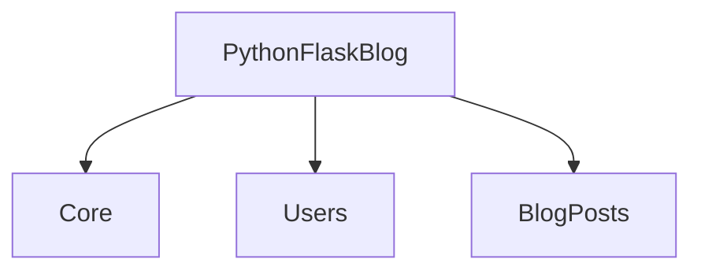
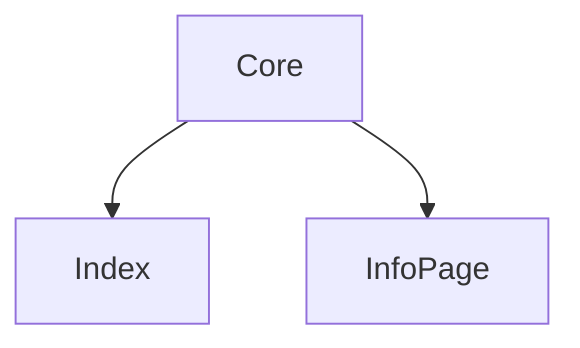
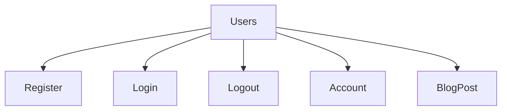
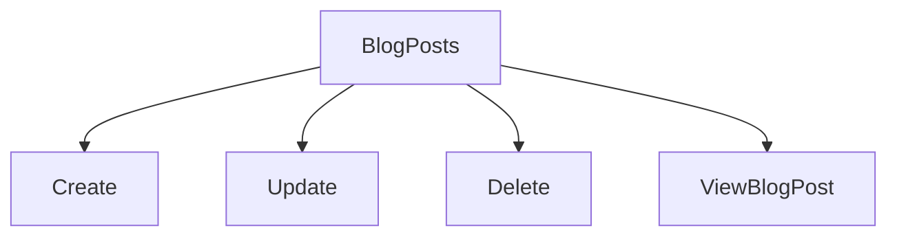
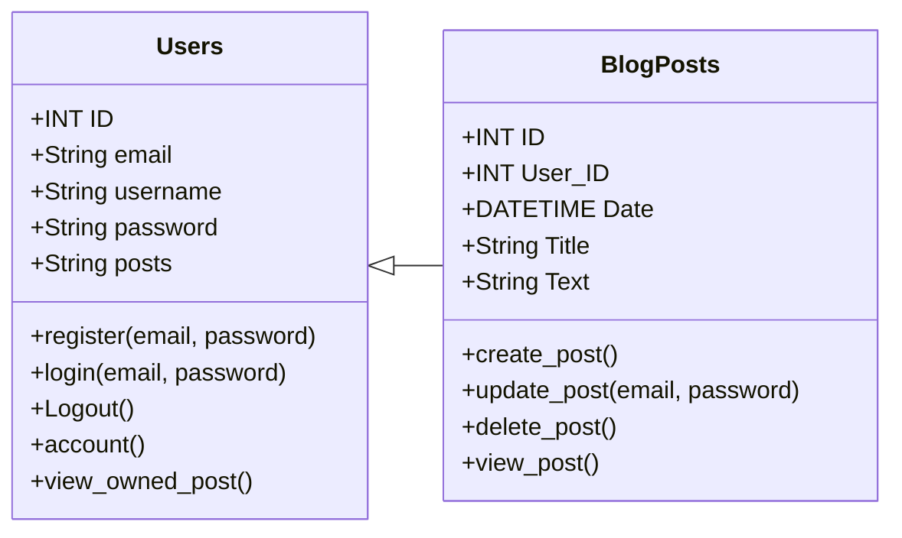
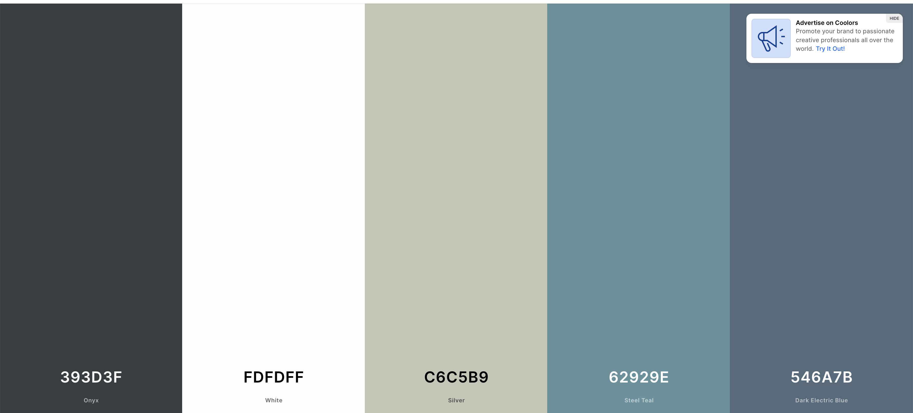
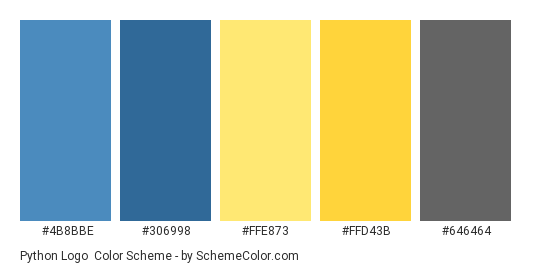

# Python Flask WebDev Blog

## Main Project Components

## Project Views

## Models

## Project Properties

### Colors

* Coolars Pallet

* Python Hex Colors

### Fonts

[Permanent Marker](https://fonts.google.com/specimen/Permanent+Marker?category=Handwriting&preview.text=PyWebDev&preview.text_type=custom)

[Inter](https://fonts.google.com/specimen/Inter?query=inter&preview.text=PyWebDev&preview.text_type=custom)

